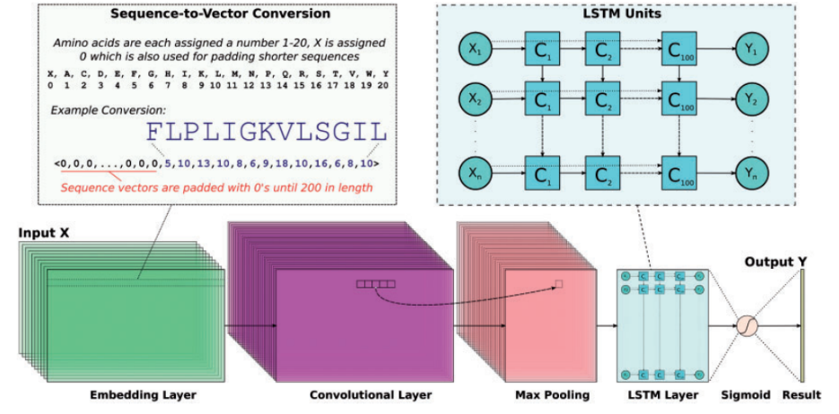

<h2> Abstract </h2>
&emsp;In our research last quarter, we concentrated on identifying antimicrobial peptide (AMP) sequences within microbial communities. Our current study broadens this scope, profiling AMPs across a diverse range of organisms. We aim to refine large datasets to contribute to microbiology improvements through advanced sequence processing techniques. We utilize a Convolutional Neural Network (CNN) and leverage the extensive sequencing data in NCBI's Reference Sequence Database (O’Leary et al. (2015)) to create detailed AMP profiles for thousands of unique species and uncover new AMPs. The impact of this research is significant within the field of microbiology, offering valuable insights into how cells adapt to manage their local microbial ecosystems. The profiling of AMPs also opens up new directions for alternative solutions/therapeutics, addressing the urgent need for antibiotics that pathogens have not developed resistance against. This research adds to the foundational scientific knowledge of microbial genomics, which is impactful towards several fields like innovation in drug discovery and development. 

<h2> Intro </h2>
   &emsp;Our Quarter 1 project laid the foundation for identifying antimicrobial peptides within microbial communities. As we transition into Quarter 2, our focus shifts towards a broader application of this concept. With the decline of current antibiotic effectiveness due to increasing resistance by harmful bacteria and other pathogens, the search for alternative treatments is more crucial than ever. (World Health Organization (2023)) One promising area of research is the study of antimicrobial peptides (AMPs). AMPs are chains of 2+ amino acids which have some form of antimicrobial activity. The mechanism of action behind each AMP can be extraordinarily varied, making the development of resistance significantly less likely  (Yeaman and Yount (2003)). Our project is focused on this exciting potential, looking to map out and understand the AMPs found across different forms of life to better understand how these sequences interact directly with the cells around them.
 
 
&emsp;We were unable to find any prior research that provided insights into how these peptides function as a part of natural immune defenses. We need broader research to really understand how to use them across all forms of life for medical treatments. Our work expands on previous research by applying advanced machine learning techniques to identify AMPs in a wide variety of organisms and to understand their structure and activity on a larger scale.
 
 
&emsp;Our study is built on a large collection of protein data from the RefSeq database (O'Leary et al. (2015)). We apply machine learning methods such as convolutional neural networks (CNNs) and long short-term memory (LSTM) networks to analyze this proteomic information. By focusing on sequenced protein data derived from genetic information, these techniques enable us to find distribution patterns of AMPs across various organisms. While our research will not discover new mechanisms of AMP function, it provides a detailed map of AMP prevalence, offering valuable data for the development of antimicrobial drugs and enhancing our public health strategies against drug-resistant diseases.
 
 

<h2> Methods </h2>

<h3> Datasets </h3>
   &emsp;The data that we utilized was sourced from RefSeq (O’Leary et al. (2015)) courtesy of our mentor, Rob Knight. The RefSeq dataset consists of 358,973 files with each file containing 4,000 - 6,000 protein sequences. We preprocessed our data by dropping duplicate entries based on the species ID, converting filepaths for faster processing format, and removing entries with nonexistent protein filepaths leaving us with 62,607 unique species/samples to be analyzed. We also added full taxonomic lineages for each species in our dataset by using the ncbitax2lin tool (available via https://github.com/zyxue/ncbitax2lin) along with the NCBI taxonomy dump Sayers et al. (2019) Schoch et al. (2020). The merged lineage dataset contains four overarching superkingdoms (Bacteria, Eukaryotes, Archaea, and Viruses) that are further divided by phylum, class, order, family, and genus. Below is a small subset of the species processed, showing the organism name, taxonomic ID, and taxonomic lineage, but omitting the filepath column.
<h3> DNN architecture </h3>
   &emsp;To predict and identify the AMPs, we built a convolutional DNN from the Keras framework (v2.10.0) using a sequential model and a TensorFlow base (v2.10.1). The motive for the DNN was to follow in line with what  Veltri, Kamath and Shehu (2018) did in their original study, showing that a DNN was effective in identifying more ambiguous patterns of AMPs that regular processing may gloss over.
 &nbsp;

    

 
 
   &emsp;The architecture of our DNN begins by transforming the peptide sequences into numerical vectors of length 200 to fit the longest AMP of the training set at 183 amino acids and the longest non-AMP at 175 amino acids. This is done by first breaking the sequence apart such that each character of the sequence is a single entry in an array. Next we assign an integer to each of the 20 basic amino acid characters and front-pad the sequence with 0’s to make the string 200 characters in length.
 
 
   &emsp;Next, these sequences are passed into an embedding layer, which takes as input the length 200 array and organizes it into a smaller vector of length 128. The convolutional layer used in this project was a 1D conv layer (filters = 64, kernel\_size = 16, activation="relu"). A convolutional layer acts as a way to store large amounts of information into a small vector while still containing all the necessary information provided to it. In short, a convolutional layer takes a small part of the input and stores small sections as certain values for the output. Do this for the entire dataset and you’re left with a compressed data structure that is easier to handle.
 
 
   &emsp;These new sequences of length 16 are passed onto a max pooling layer (pool\_length = 5) that uses a sliding window method across the sequence and takes the largest value from it, giving back a representation of the output from the convolutional layer and helps to avoid overfitting. Our model incorporates the use of an LSTM layer (units = 100, unroll = True, stateful = False, dropout = 0.1), which stands for Long Short Term Memory layer. The main purpose of this layer is that it learns long term dependencies of sequential data, making it a perfect fit for peptide sequences. An LSTM layer is a recurrent neural network, meaning that, unlike a traditional neural network, it stores and uses the data it has been passed in as a reference point for the rest of the input. Being able to remember the sequence and its attributes as it gets passed in helps to identify these AMPs. Lastly, the model is tuned with an Adam optimizer with default values and is scored with accuracy using binary cross entropy as our loss function and trained for 10 epochs.
<h2> Results </h2>
   &emsp;Lorem ipsum dolor sit amet, consectetur adipiscing elit. Phasellus at molestie dui, sit amet rutrum nisi. Aliquam elementum hendrerit tellus ac efficitur. Donec in tristique enim, eu egestas nisi. In hac habitasse platea dictumst. Vestibulum sed felis dui. Morbi sagittis enim non quam sagittis, pretium pulvinar velit faucibus. Cras ullamcorper urna sed mauris fringilla, nec malesuada ante tempus. Praesent tempus, metus ac aliquet laoreet, mauris nisi luctus ligula, et tincidunt velit sapien et eros. Fusce bibendum pretium ligula. Nulla a velit lorem. Curabitur hendrerit id sapien eget semper. Mauris consectetur, turpis ac tincidunt imperdiet, nulla orci volutpat odio, ornare porta quam dolor et felis. Vestibulum lobortis ante vitae diam sodales, in viverra risus vestibulum. Integer ac fringilla purus, vitae luctus lorem. Pellentesque efficitur, sapien at ornare luctus, dui ante tempus ex, vel semper leo lacus eget diam. Duis et urna erat.

<h2> Discussion </h2>

<h3> Analysis of Results </h3>
&emsp;Of the four superkingdoms present in the dataset (Figure 2), the eukaryotes exhibited a significantly higher average number of antimicrobial peptides (AMPs) compared to the other superkingdoms, a striking observation that warrants further investigation. This disparity can be attributed to the intricate cellular organization of eukaryotic organisms, which allows for the accommodation of a larger repertoire of AMPs and amino acid sequences within each species. Moreover, as eukaryotes face constant threats from microbial invaders, the elevated presence of AMPs serves as a robust defense mechanism, a plausible evolutionary adaptation to bolster their survival.
 
 
&emsp;In Figure 3, we observed that our model consistently identified antimicrobial peptides (AMPs) across large datasets efficiently. This is an improvement over some prior studies. Despite diverse data volumes, our processing times remained stable, showing our model’s potential for high bandwidth applications. Limitations include dependency on accurate AMP labeling and the scope of the training data. Future work could involve refining the model with more datasets and exploring new machine learning techniques to enhance AMP identification and contribute to combating antibiotic resistance.
 
 
&emsp;In contrast, viral species displayed an exceptionally low number of AMPs, with the median value being zero among the 6500+ viral species analyzed. This finding is not surprising when we consider the nature of viruses and their reliance on maintaining the host organism’s viability for their propagation. The presence of numerous AMPs could potentially disrupt the host’s homeostasis, thereby reducing the chances of viral proliferation and jeopardizing their survival strategy.
 
 
&emsp;The analysis also extends to the specific properties of the AMPs themselves, unveiling intriguing insights. Many of these peptides can be characterized as membrane proteins, a finding that aligns with their functional role of mediating cell-environment interactions, positioning them as the first line of defense against harmful microbes. Consequently, their antimicrobial properties serve as a strategic adaptation for cellular protection.
 
 
&emsp;Furthermore, the characterized membrane proteins identified as AMPs can shed light on uncharacterized proteins that exhibit antimicrobial properties. A prime example is illustrated in the figure below. While the protein on the right is uncharacterized by biologists, it shares striking similarities with the known membrane protein on the left. Both are classified as AMPs, and both exhibit a distinct structural pattern, featuring a densely populated amino acid head region that tapers into a long tail-like structure. Leveraging this knowledge, we can reasonably hypothesize that the uncharacterized protein on the right is also a membrane protein used by the cell for defensive purposes, given their structural resemblance.
 
 

    

 
 
<h3> Conclusion</h3>
&emsp;The knowledge and results obtained from this experiment have paved the way for numerous potential future research avenues. One promising direction lies in investigating the differences in AMP clusters and their distribution across various taxonomic groups. Such an endeavor could prove invaluable in understanding the transitive properties of certain AMPs and their potential applications in combating diverse microbial threats.
 
 
&emsp;Notably, the eukaryotic organisms have a significantly higher rate of AMPs compared to other kingdoms. These peptides give insight into the ways eukaryotes manage the microbial communities around them. Delving deeper into the properties of specific AMPs can shed further light on our current understanding of these molecules and possibly lead to the creation of new classes of antibiotics.
 
 
&emsp;The results from this study also highlight the potential for identifying and classifying the uncharacterized AMPs that our model has uncovered. While many AMPs could be membrane proteins, a significant number originate from species that have not been extensively studied, hindering their proper characterization. Building upon the findings illustrated in Figure 4, it may be prudent to develop a novel machine learning model to analyze the amino acid sequences that compose these uncharacterized AMPs and attempt to find relations to characterized AMPs.

<h3> Limitations </h3>
&emsp;Due to time and computational constraints, our analysis was limited to a single example per species from the large datasets we had access to. No duplicate entries were included in the process. While we believe that this limitation does not significantly impact the overall output, it is worth noting that there may be specific edge cases or instances where a sample from a different part of the organism could have been more representative.
 
 
&emsp;Additionally, our findings relied on the accuracy of the employed model. Currently, we utilize a 99\% confidence metric to determine whether a sequence is classified as an AMP. Although the results thus far do not indicate a need for adjustment, it is important to acknowledge that even a slight modification, such as using a 95\% confidence interval, could lead to substantial changes in the outcome.

<h3> Future Research </h3>
&emsp;Future research aims to establish taxonomic relationships to identify the most prevalent AMPs across species. This work will enhance our understanding of common AMPs within taxonomic clusters and clarify how organisms adapt to their environments. Identifying AMP clusters in various species, we seek insights into their function and evolutionary importance. This study will reveal how species and taxonomies control their microbial populations, highlighting AMPs’ key role in microbial adaptation

<h1> References </h1>

  Donec vel elementum lorem. Curabitur ut maximus lacus, et condimentum nisi. Quisque at nisi vitae risus posuere ultricies vitae non sapien. In id iaculis justo. Sed ut iaculis metus. Mauris eget sollicitudin arcu. Phasellus erat tortor, laoreet a dictum et, efficitur pulvinar lectus.
  
  Fusce faucibus ligula a ante congue lobortis. Fusce posuere tristique est eu pulvinar. Proin aliquet porta enim ut aliquam. Nulla ac blandit turpis. Praesent sit amet lacinia eros, in fringilla orci. Ut nibh sem, mattis porta bibendum ac, tristique at ex. Mauris feugiat efficitur dolor ut commodo. Vestibulum condimentum faucibus congue. Maecenas sit amet quam tempus, fringilla tellus quis, aliquet orci. Proin ac turpis et diam convallis varius. 
